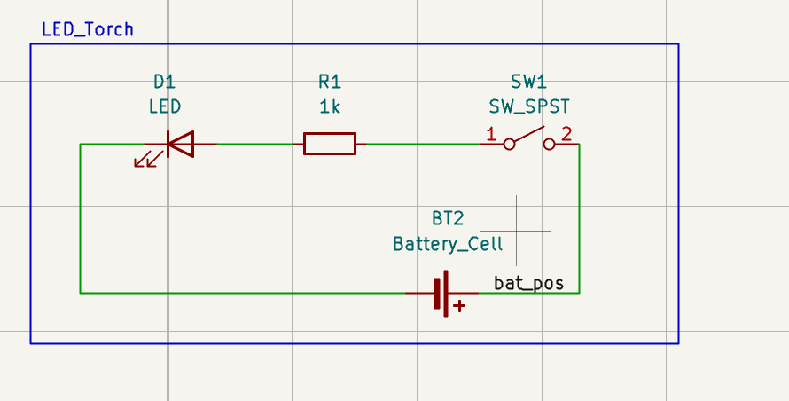
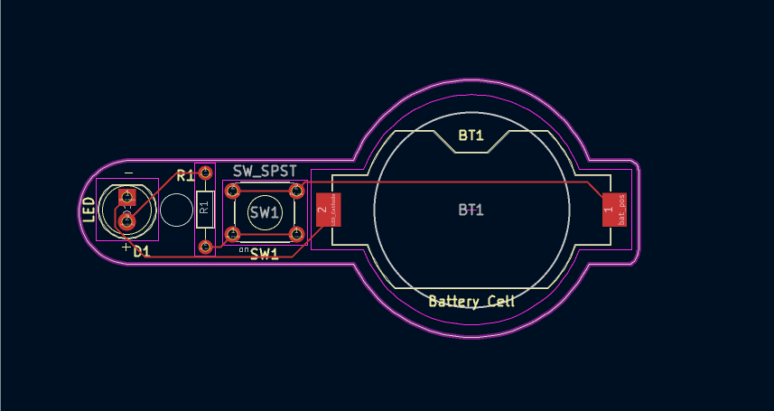
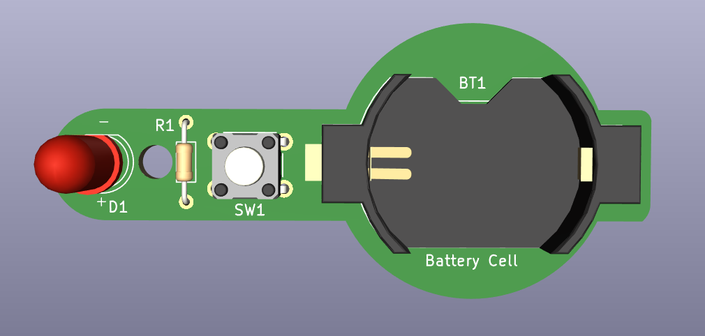
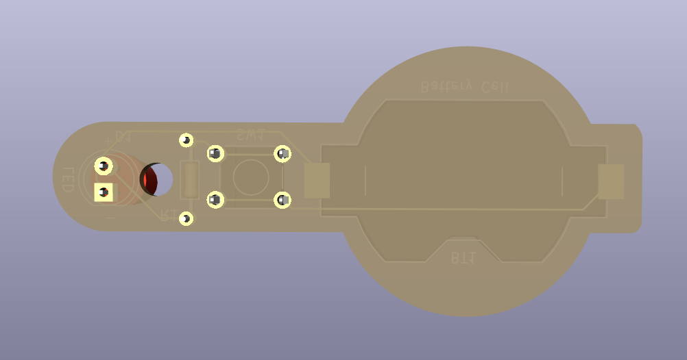
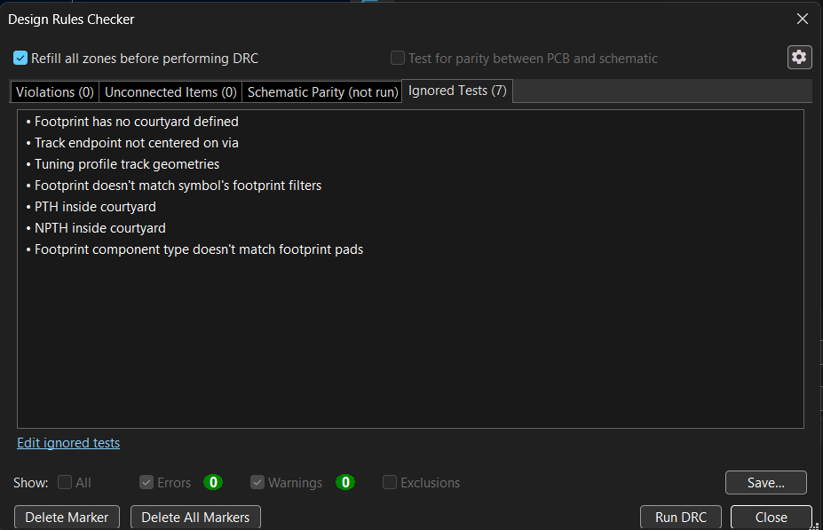
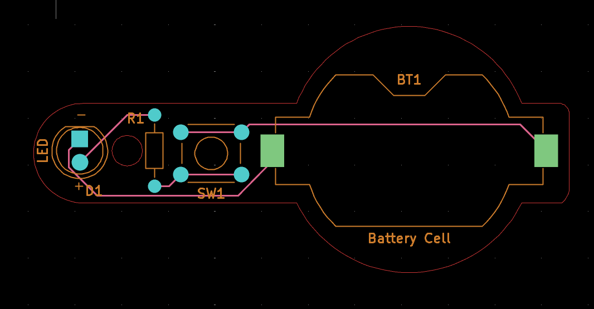

# LED Torch

## Overview

This project is a compact LED torch PCB designed as part of the **PCB Design with KiCad - Updated for KiCad 9** Udemy course.

The circuit uses a single battery cell to power an LED through a current-limiting resistor and an SPST switch.

This project was recreated in KiCad as part of my practical PCB design learning process.

---

## Circuit

The basic circuit consists of:

- Single-cell battery
- SPST ON/OFF switch
- 1 kΩ current-limiting resistor
- 5 mm LED

### Schematic



---

## PCB Design

The PCB was designed as a compact torch-shaped board with an integrated battery holder footprint.

### PCB Layout



### 3D View

#### Front



#### Back



---

## Components

| Reference | Component | Value | Footprint |
|---|---|---|---|
| R1 | Resistor | 1 kΩ | R_Axial_DIN0204_L3.6mm_D1.6mm_P7.62mm_Horizontal |
| D1 | LED | LED | LED_D5.0mm |
| SW1 | SPST Switch | SW_SPST | SW_TH_Tactile_Omron_B3F-100x |
| BT1 | Battery Holder | Battery Cell | BatteryHolder_Keystone_1058_1x2032 |

---

## Bill of Materials

The Interactive HTML BOM was generated using the **InteractiveHtmlBom** tool.

**[View Interactive BOM](./BOM/LED_Torch_ibom.html)**

The interactive BOM provides:

- Component references
- Component values
- Footprints
- Descriptions
- Quantities
- Component locations on the PCB

---

## Design Verification

### Design Rule Check

The PCB was checked using KiCad's Design Rule Checker (DRC).



### Gerber Verification

The generated manufacturing files were opened and inspected using KiCad Gerber Viewer.



---

## Manufacturing Files

The `Gerbers/` directory contains the manufacturing outputs generated from KiCad, including:

- Front copper
- Back copper
- Front solder mask
- Back solder mask
- Front silkscreen
- Back silkscreen
- Board outline
- Drill files
- Gerber job file

---

## KiCad Project Files

The complete KiCad project files are available in the `KiCad/` directory.

```text
KiCad/
├── Led torch.kicad_pro
├── Led torch.kicad_sch
└── Led torch.kicad_pcb