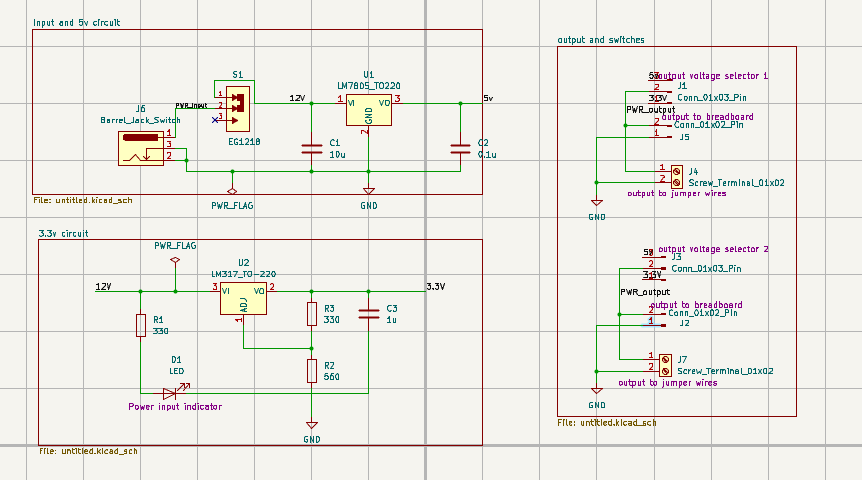
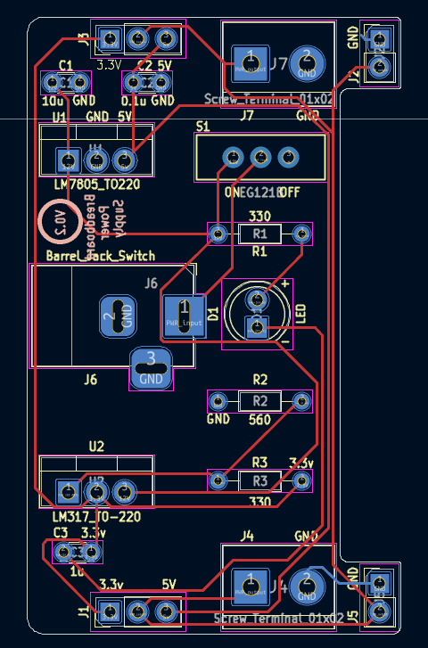
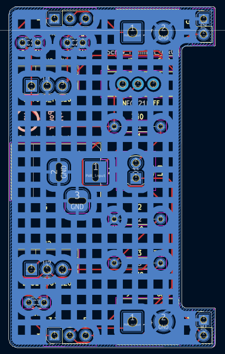
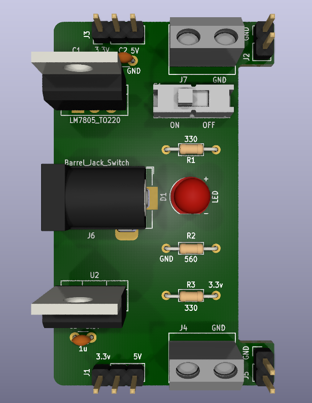
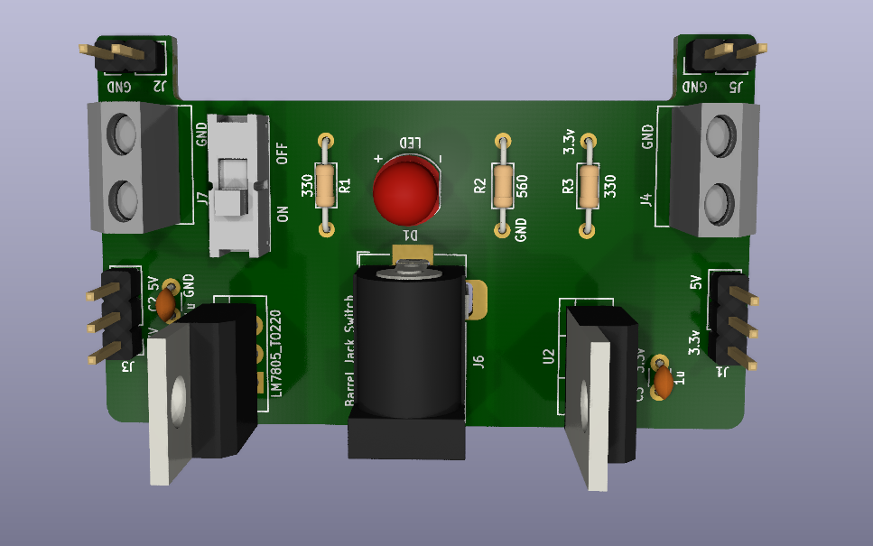
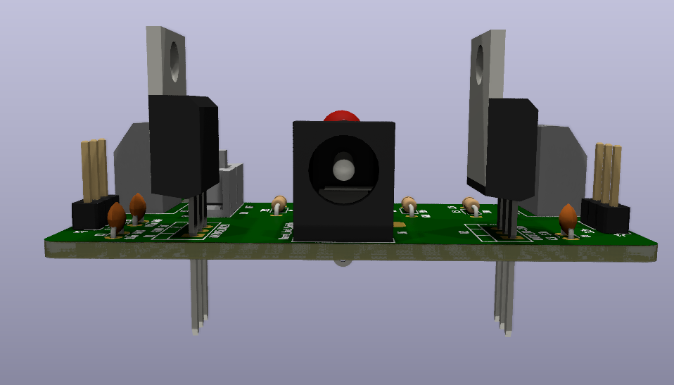
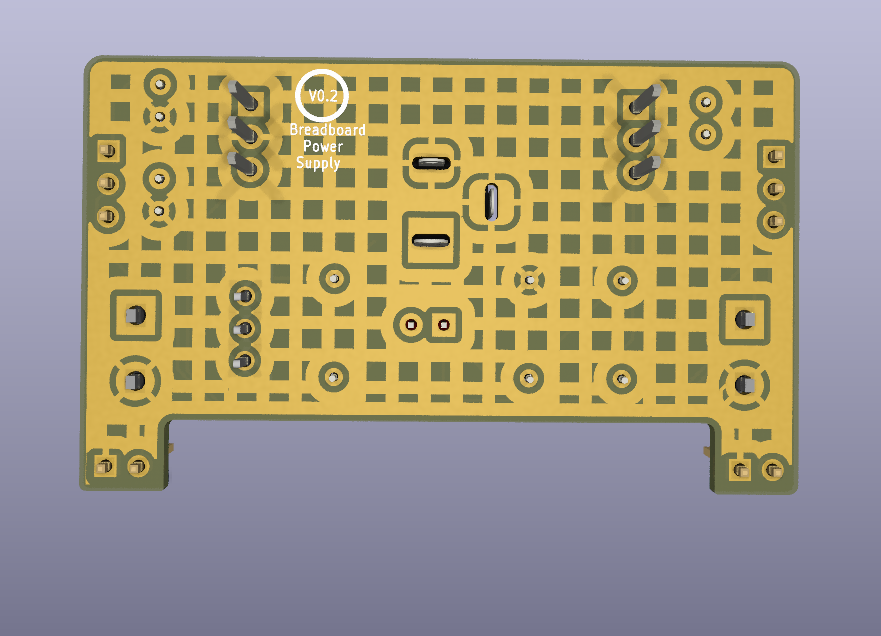
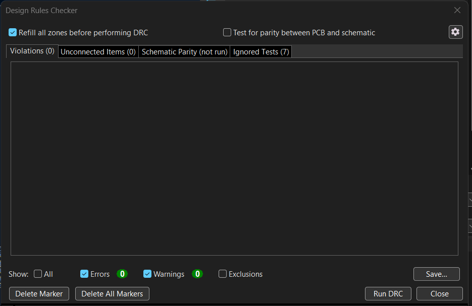
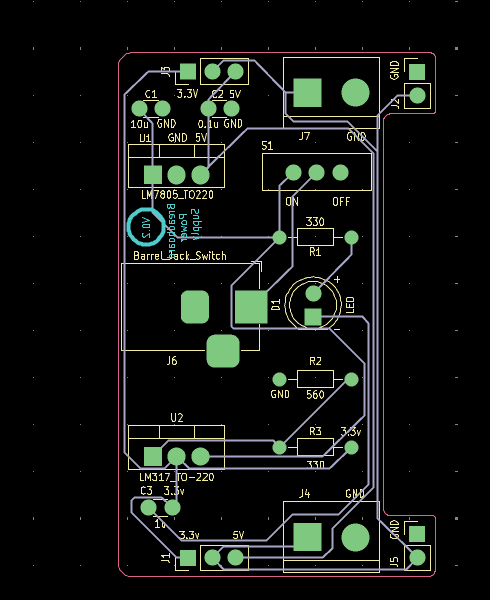
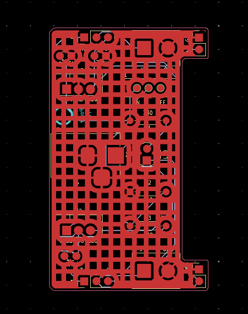

# Breadboard Power Supply

## Overview

This project is a breadboard power supply PCB designed as part of the **PCB Design with KiCad - Updated for KiCad 9** Udemy course.

The board accepts a **12 V DC input** and provides regulated **5 V and 3.3 V outputs** for powering breadboard-based electronic circuits.

The PCB includes voltage regulation, a power indicator LED, output selection, breadboard connectors, jumper-wire terminals, and a ground plane.

---

## Features

- 12 V DC input
- Regulated 5 V output using LM7805
- Regulated 3.3 V output using LM317
- Power indicator LED
- Output voltage selection
- Breadboard output connectors
- Jumper-wire output terminals
- Through-hole component design
- Custom PCB layout
- Ground plane
- Design Rule Check (DRC)
- Interactive HTML BOM
- Gerber generation and verification
- KiCad 3D visualization

---

## Working Principle

The 12 V DC input is supplied to the PCB through a barrel jack. The input is then distributed to two regulator sections to generate the required output voltages.

### 12 V to 5 V Regulation

The 12 V input is supplied through the power switch to the **LM7805** voltage regulator.

The LM7805 regulates the input voltage and provides a regulated **5 V output**.

Input and output capacitors are included for filtering and regulator stability.

```text
12 V DC Input
      │
      ▼
 Power Switch
      │
      ▼
    LM7805
      │
      ▼
     5 V
```

### 12 V to 3.3 V Regulation

The 12 V input is also supplied to the **LM317** adjustable voltage regulator.

The resistor network connected to the LM317 adjustment circuit sets the regulator output to approximately **3.3 V**.

```text
12 V DC Input
      │
      ▼
    LM317
      │
      ▼
 Resistor Network
      │
      ▼
    3.3 V
```

### Power Indicator

An LED with a current-limiting resistor is used as a power indicator. The LED indicates that the board is receiving power.

### Output Selection

The regulated outputs are connected to output selector connectors and screw terminals, allowing the required voltage to be supplied to a breadboard or external circuit.

---

## Schematic

The complete circuit schematic was designed using KiCad.



---

## PCB Design

The PCB was designed as a compact through-hole board with the regulators, connectors, switch, and other components arranged for breadboard power supply use.

### PCB Layout



### PCB Layout with Ground Zone



---

## 3D Visualization

### Top View



### Alternate Top View



### Side View



### Back View



---

## Components

| Reference | Component | Value / Part |
|---|---|---|
| U1 | 5 V Voltage Regulator | LM7805_TO220 |
| U2 | Adjustable Voltage Regulator | LM317_TO220 |
| S1 | Power Switch | EG1218 |
| D1 | LED | Power Indicator |
| R1 | Resistor | 330 Ω |
| R2 | Resistor | 560 Ω |
| R3 | Resistor | 330 Ω |
| C1 | Capacitor | 10 µF |
| C2 | Capacitor | 0.1 µF |
| C3 | Capacitor | 1 µF |
| J6 | Barrel Jack | DC Power Input |
| J1, J3 | Output Connectors | Breadboard Output |
| J4, J7 | Screw Terminals | Jumper-Wire Output |

---

## Bill of Materials

An Interactive HTML BOM was generated using **InteractiveHtmlBom**.

[View Interactive BOM](https://reon-02.github.io/PCB-Design-with-KiCad-Udemy/02_Bread_Power_Supply/BOM/Breadboard_Power_Supply_ibom.html)

The interactive BOM provides:

- Component references
- Component values
- Footprints
- Descriptions
- Datasheet information where available
- Component quantities
- Component locations on the PCB

---

## Design Verification

### Design Rule Check

The PCB was checked using KiCad's Design Rule Checker (DRC).



### Gerber Verification

The generated manufacturing files were opened and inspected using KiCad Gerber Viewer.



### Gerber Viewer with Ground Zone



---

## Manufacturing Files

The `Gerbers/` directory contains the manufacturing outputs generated from KiCad, including:

- Front copper
- Back copper
- Front solder mask
- Back solder mask
- Front solder paste
- Back solder paste
- Front silkscreen
- Back silkscreen
- Board outline
- PTH drill file
- NPTH drill file
- Gerber job file

---

## Datasheets

Datasheets for the main components used in the design are included in the `Datasheets/` directory.

- [EG1218 Switch Datasheet](./Datasheets/EG1218.pdf)
- [LM317 Datasheet](./Datasheets/lm317.pdf)
- [MC7800 Datasheet](./Datasheets/MC7800-D.PDF)

---

## KiCad Project Files

The complete KiCad project files are available in the `KiCad/` directory.

```text
KiCad/
├── breadboard.kicad_pro
├── breadboard.kicad_sch
└── breadboard.kicad_pcb
```

---

## Project Structure

```text
02_Bread_Power_Supply/
│
├── README.md
│
├── KiCad/
│   ├── breadboard.kicad_pro
│   ├── breadboard.kicad_sch
│   └── breadboard.kicad_pcb
│
├── BOM/
│   └── Breadboard_Power_Supply_ibom.html
│
├── Datasheets/
│   ├── EG1218.pdf
│   ├── lm317.pdf
│   └── MC7800-D.PDF
│
├── Gerbers/
│   ├── Gerber files
│   └── Drill files
│
└── Images/
    ├── Schematic.png
    ├── PCB_Layout.png
    ├── PCB_layout_with_zone.png
    ├── 3d_top_view.png
    ├── 3d_top_view1.png
    ├── 3d_side.png
    ├── 3d_back.png
    ├── DRC.png
    ├── Gerber_Viewer.png
    └── Gerber_viewer_zone.png
```

---

## What I Practiced

Through this project, I practiced:

- Schematic capture
- Voltage regulator circuit design
- Component selection
- Footprint assignment
- Through-hole PCB layout
- PCB component placement
- PCB routing
- Ground plane creation
- Silkscreen placement
- Design Rule Checking
- Interactive BOM generation
- Gerber generation
- Gerber verification
- KiCad 3D visualization
- Datasheet reference
- Preparing PCB files for manufacturing

---

## Course

This project was completed as part of:

**[PCB Design with KiCad - Updated for KiCad 9](https://www.udemy.com/share/105YR03@hdEVWNpVydDwXK-DHMVmjIG6j6jP2o1doZVhvYaCLZwN9b4QRBgg-SJO-xgzQPG_Kw==/)**

**Platform:** Udemy
