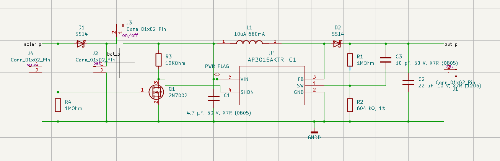
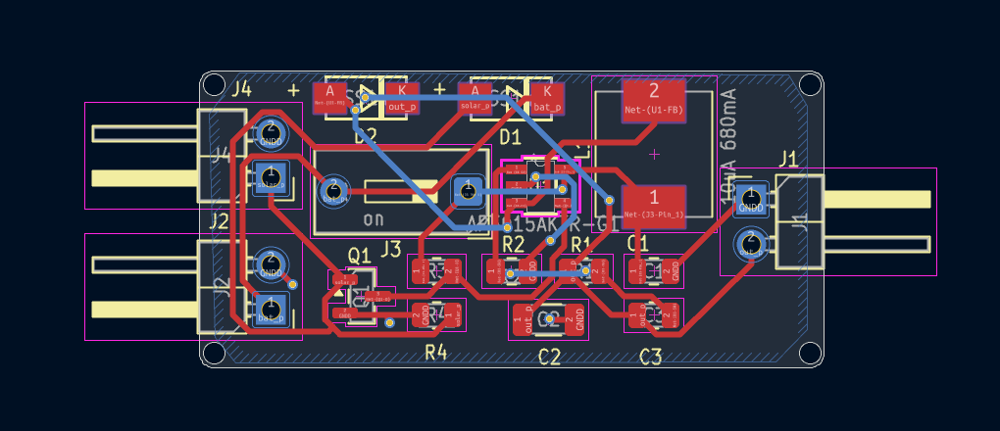
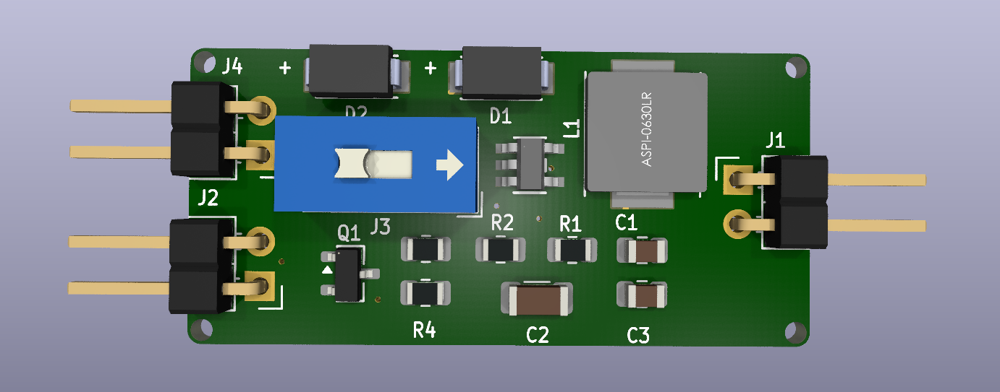
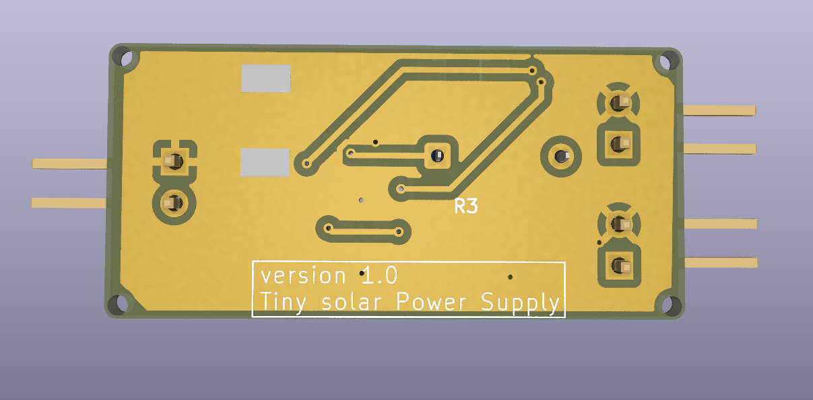
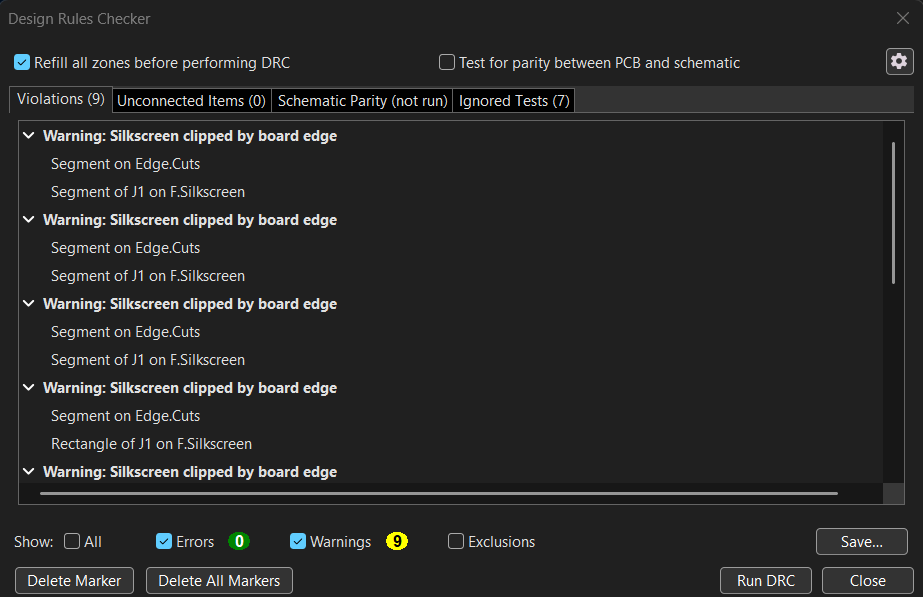
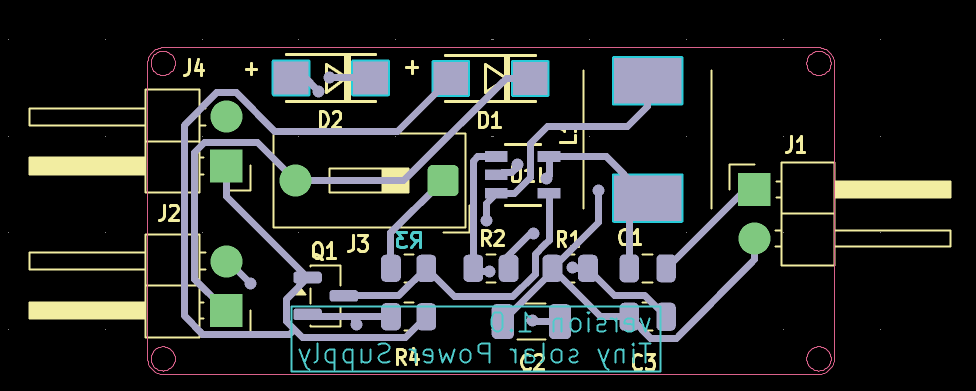
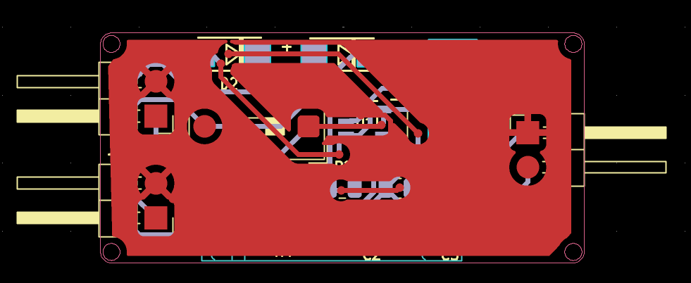

# Solar Power Supply

## Overview

This project is part of the **Solar Power Supply** section of the **PCB Design with KiCad - Updated for KiCad 9** Udemy course.

The circuit is designed to accept power from a solar source and provide a regulated output using a boost converter based on the **AP3015AKTR-G1**.

The design includes input protection, battery connection, power switching, boost conversion, filtering, and output voltage feedback.

---

## Features

- Solar power input
- Battery connection
- Reverse-polarity protection
- AP3015AKTR-G1 boost converter
- Inductor-based DC-DC conversion
- Output voltage feedback
- Custom PCB layout
- Ground plane
- Interactive HTML BOM
- Gerber generation and verification

---

## Working Principle

The solar power supply is designed to accept power from a solar source or battery and use a boost converter to generate the required output voltage.

### Solar Input

The solar input is connected through the input connector. An SS14 Schottky diode is used at the input to provide reverse-current protection and prevent current from flowing back toward the solar source.

### Battery and Power Switching

A battery can also be connected to the circuit. The solar and battery power paths are connected to the power switching section, where the 2N7002 MOSFET and associated resistors control the connection of the available input power to the boost converter.

### Boost Conversion

The AP3015AKTR-G1 boost converter performs the main DC-DC voltage conversion. The converter uses an external 10 µH inductor and switching circuitry to transfer energy from the input to the output and generate a higher voltage.

### Output Filtering

An SS14 Schottky diode is used in the boost converter output path. The output capacitors filter the converted voltage and reduce voltage ripple, providing a smoother DC output.

### Output Voltage Regulation

The output voltage is monitored using a resistor feedback network consisting of R1 and R2. The feedback voltage is applied to the FB pin of the AP3015, allowing the converter to adjust its switching operation and maintain the required output voltage.

---

## Schematic

The complete Solar Power Supply circuit was designed using KiCad.



---

## PCB Design

The PCB was designed using KiCad with the components arranged for a compact solar power supply circuit.

### PCB Layout



---

## 3D Visualization

### Front View



### Back View



---

## Components

| Reference | Component | Value / Part |
|---|---|---|
| U1 | Boost Converter | AP3015AKTR-G1 |
| Q1 | N-Channel MOSFET | 2N7002 |
| L1 | Inductor | 10 µH, 680 mA |
| D1 | Schottky Diode | SS14 |
| D2 | Schottky Diode | SS14 |
| R1 | Resistor | 1 MΩ |
| R2 | Resistor | 604 kΩ, 1% |
| R3 | Resistor | 10 kΩ |
| R4 | Resistor | 1 MΩ |
| C1 | Capacitor | 4.7 µF, 50 V, X7R |
| C2 | Capacitor | 22 µF, 10 V, X7R |
| C3 | Capacitor | 10 pF, 50 V, X7R |
| J2 | Connector | Battery Input |
| J4 | Connector | Solar Input |
| J3 | Connector | Power Switch |
| J1 | Connector | Output |

---

## Bill of Materials

An Interactive HTML BOM was generated using **InteractiveHtmlBom**.

[Open Interactive BOM](https://reon-02.github.io/PCB-Design-with-KiCad-Udemy/03_Solar_Power_Supply/BOM/Solar_Power_Supply_ibom.html)

The Interactive BOM provides:

- Component references
- Component values
- Footprints
- Component quantities
- Component locations
- Interactive PCB component highlighting

---

## Design Verification

### Design Rule Check

The PCB was checked using KiCad's **Design Rule Checker (DRC)**.



### Gerber Verification

The generated manufacturing files were opened and inspected using KiCad Gerber Viewer.



### Gerber Viewer with Ground Zone



---

## Manufacturing Files

The `Gerbers/` directory contains the manufacturing outputs generated from KiCad, including:

- Copper layers
- Solder mask layers
- Solder paste layers
- Silkscreen layers
- Board outline
- PTH drill file
- NPTH drill file
- Gerber job file

---

## Datasheets

Datasheets for the main components used in the design are included in the `Datasheets/` directory.

- [AP3015A Datasheet](./Datasheets/AP3015_A.pdf)
- [Abracon ASPI-0630LR-100M-T15 Datasheet](./Datasheets/ASPI-0630LR-100M-T15_Abracon.pdf)
- [2N7002A Datasheet](./Datasheets/NDS7002A-D.PDF)
- [SS14 Datasheet](./Datasheets/SS14_ON.pdf)

---

## KiCad Project Files

The complete KiCad project files are included in the project directory.

```text
solar power supply.kicad_pro
solar power supply.kicad_sch
solar power supply.kicad_pcb
