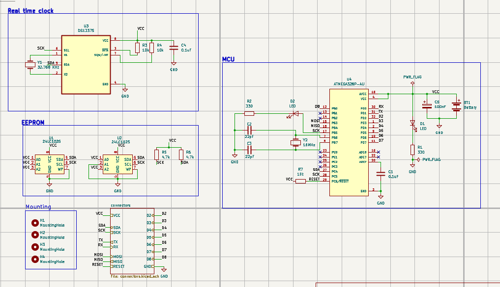
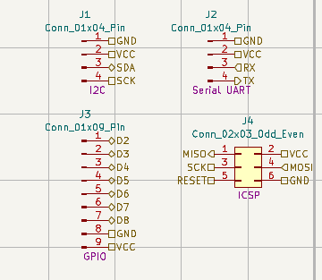
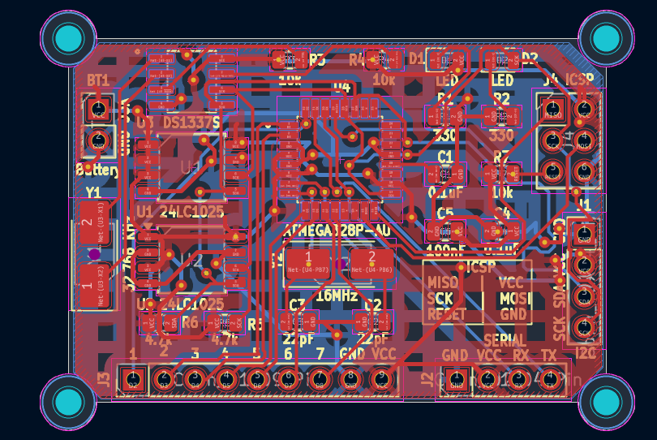
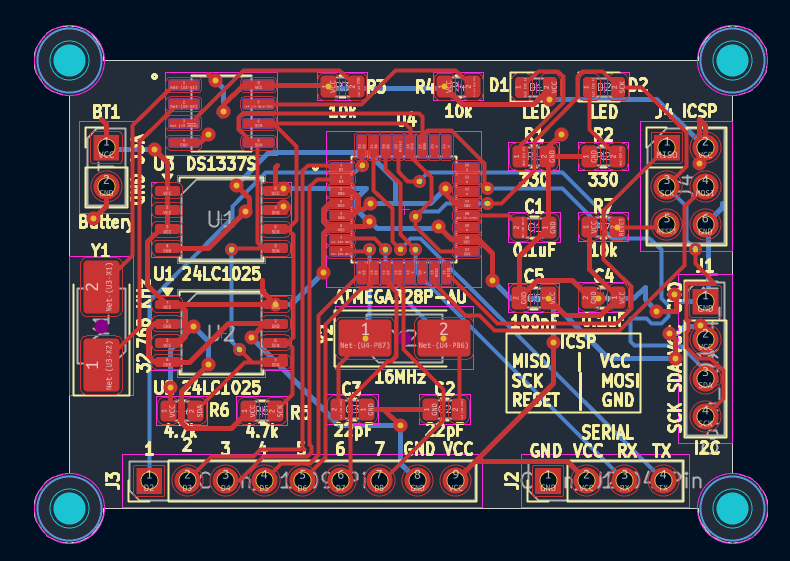
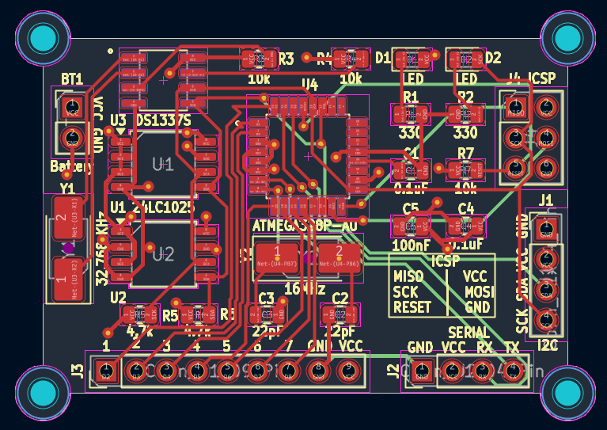
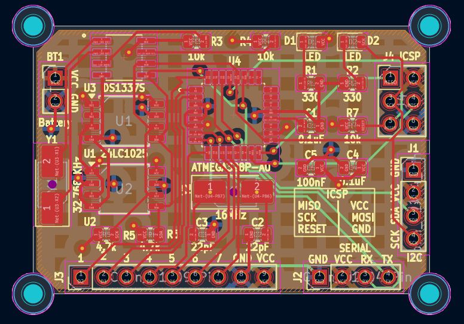
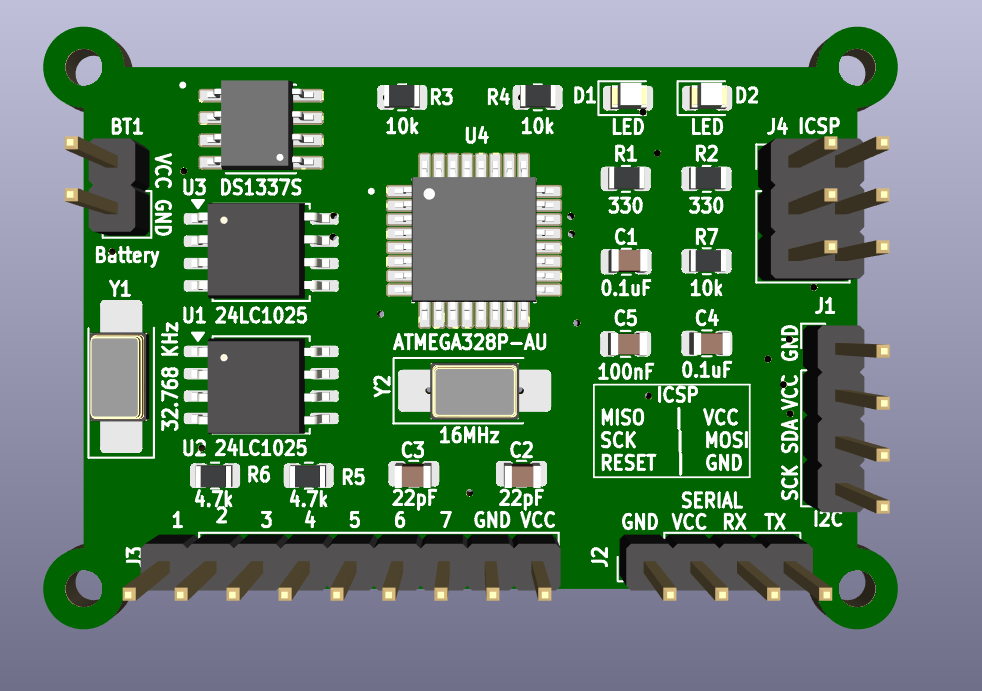
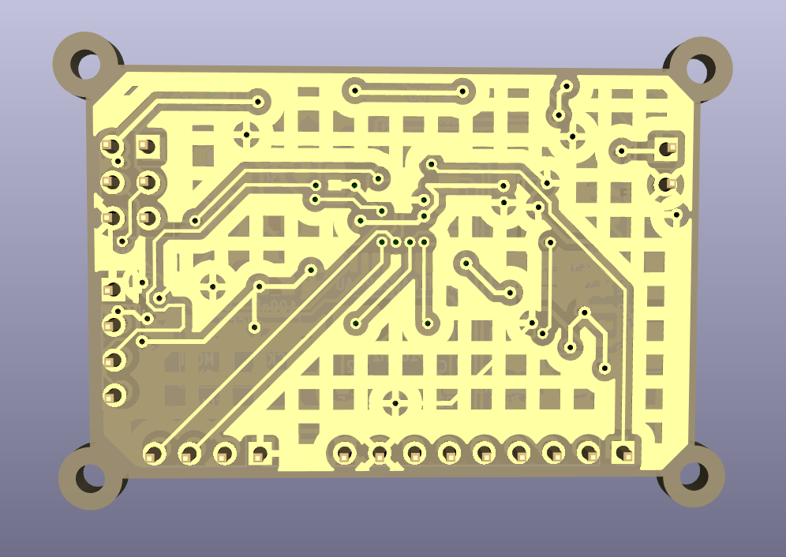
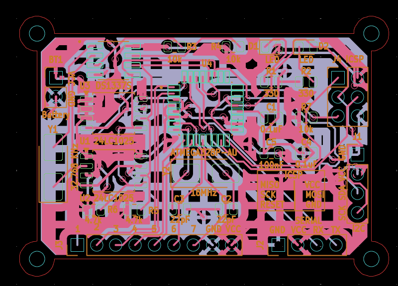
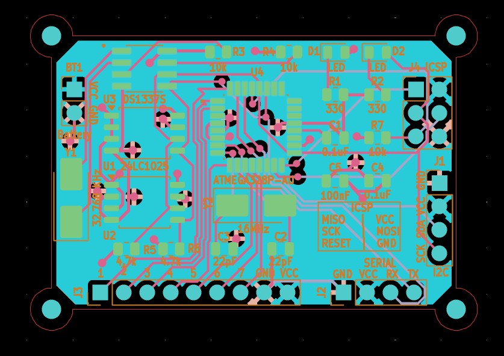

# MCU Data Logger

A microcontroller-based data logger PCB designed using KiCad as part of the **PCB Design with KiCad - Updated for KiCad 9** Udemy course.

The project is built around an **ATmega328P-AU** microcontroller and includes an external real-time clock, EEPROM memory, communication interfaces, programming interface, and external I/O connections. Both **2-layer and 4-layer PCB versions** were designed.

---

## Features

- ATmega328P-AU microcontroller
- DS1337S real-time clock
- External EEPROM memory
- I²C communication
- UART interface
- ISP programming interface
- 2-layer and 4-layer PCB versions
- Interactive HTML BOM
- Gerber generation and verification

---

## Working

The ATmega328P-AU acts as the main controller of the data logger. It communicates with the DS1337S real-time clock and external EEPROM through the I²C interface.

The real-time clock provides accurate time information, while the external EEPROM provides non-volatile memory for storing data.

The PCB also provides UART connectivity for serial communication and an ISP interface for programming the ATmega328P-AU. External connectors expose power, communication signals, and GPIO connections for interfacing with other circuits or modules.

The microcontroller operates using an external crystal oscillator, while the DS1337S uses a dedicated 32.768 kHz crystal for timekeeping.

---

## Schematic

The complete MCU Data Logger circuit was designed using KiCad.





---

## PCB Design

Two PCB implementations were developed for the project.

### 2-Layer PCB





### 4-Layer PCB





---

## 3D Visualization

### Front View



### Back View



---

## Components

| Reference | Component | Purpose |
|---|---|---|
| U4 | ATmega328P-AU | Main microcontroller |
| U3 | DS1337S | Real-time clock |
| U1, U2 | 24LC1025 | External EEPROM memory |
| Y1 | 32.768 kHz Crystal | RTC clock source |
| Y2 | 16 MHz Crystal | MCU clock source |
| D1 | LED | Power indication |
| J4 | ISP Connector | MCU programming |
| J1–J3 | External Connectors | Power, communication and I/O |
| H1–H4 | Mounting Holes | PCB mounting |

---

## Interactive BOM

The Interactive BOM provides component references, values, footprints, quantities, and interactive PCB component highlighting.

**[View Interactive BOM](https://reon-02.github.io/PCB-Design-with-KiCad-Udemy/04_MCU_Datalogger/BOM/MCU_Datalogger_ibom.html)**

---

## Design Verification

The PCB designs were checked using KiCad Design Rule Check (DRC), and the generated Gerber files were verified using the KiCad Gerber Viewer.

### 2-Layer Gerber Verification



### 4-Layer Gerber Verification



---

## Manufacturing Files

The project includes the generated Gerber and drill files required for PCB manufacturing.

The Gerber files include:

- Copper layers
- Solder mask layers
- Silkscreen layers
- Paste layers
- Edge cuts
- Drill files
- Gerber job file

---

## Datasheets

The relevant component datasheets used during the design are included in the `Datasheets` folder.

- [21941](./Datasheets/21941.pdf)
- [ATmega328P-AU Datasheet](./Datasheets/ATMEGA328PAU_Microchip_Technology.pdf)
- [DS1337S Datasheet](./Datasheets/DS1337S_Maxim_Integrated_Products.pdf)

---

## KiCad Project Files

The project contains both 2-layer and 4-layer PCB designs.

### 2-Layer Design

Located in:

```text
Kicad_2layer/